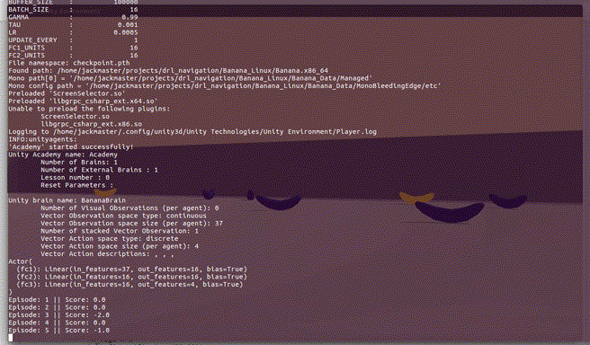
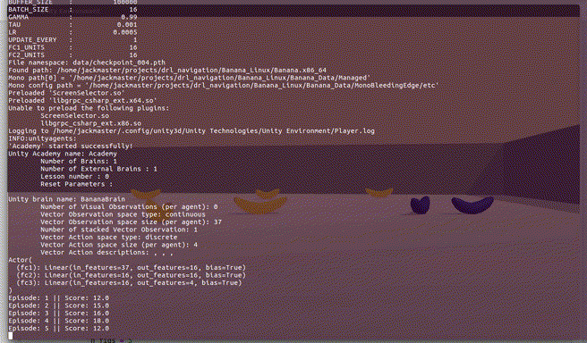

# Deep Reinforcement Learning for Navigation

A bananas collector navigation problem of Unity ML-Agents is solved with DRL using DQN and some additional improvements. Therefore this problem has a continuous state space and a discrete action space.

From Tabula rasa

to skilled agent


## Project Details

The Banana Collector navigation problem has an agent moving around a rectangular area with the goal of collect yellow bananas and avoid blue bananas. The state space sum up a 37D vector represented by one 2D vector representing the velocity and 35D vector representing a ray-based perception sensor. The agent has to decide between four actions each time step to maximize its total reward, the set of actions are

* `0`: to move forward
* `1`: to move backward
* `2`: to turn left
* `3`: to turn right

And the reward could be summarized as

* `+1`: Pick up a yellow banana
* `-1`: Pick up a blue banana

The task could be seen as episodic where is considered solved when the agent would get at least an average score of +13 over 100 consecutive episodes.

## Dependencies

To set up your python environment in a working Anaconda session to run the code in this repository, follow the instructions below.

1. Create (and activate) a new environment with Python 3.6 with conda.

    - __Linux__ or __Mac__: 
    ```bash
    conda create --name drlnavigation python=3.6
    source activate drlnavigation
    ```
    - __Windows__: 
    ```bash
    conda create --name drlnavigation python=3.6 
    activate drlnavigation
    ```

1. Install OpenAI gym and ipykernel.

    ```bash
    pip install gym
    ```

1. Clone or copy just ```python``` folder from the following [repo](https://github.com/udacity/deep-reinforcement-learning) inside this repo, then change directory to the copied folder and install it with the following command.

    ```bash
    pip install .
    ```
    This step is needed because we're using the ___Unity ML-Agents v0.4___ for a customized environment of the [Banana Collector](https://github.com/Unity-Technologies/ml-agents/blob/master/docs/Learning-Environment-Examples.md#banana-collector) learning environment. Here in this step are configured libraries like ```tensorflow``` and ```torch```. See the [requirements.txt](https://github.com/udacity/deep-reinforcement-learning/blob/master/python/requirements.txt) file, to create an appropriate environment.

1. Create an [IPython kernel](http://ipython.readthedocs.io/en/stable/install/kernel_install.html) for the `drlnavigation` environment.  

    ```bash
    python -m ipykernel install --user --name drlnavigation --display-name "drlnavigation"
    ```

1. Download the Unity Environment

    - Linux [here](https://s3-us-west-1.amazonaws.com/udacity-drlnd/P1/Banana/Banana_Linux.zip)
    - Mac OSX [here](https://s3-us-west-1.amazonaws.com/udacity-drlnd/P1/Banana/Banana.app.zip)
    - Windows (64-bit) [here](https://s3-us-west-1.amazonaws.com/udacity-drlnd/P1/Banana/VisualBanana_Windows_x86_64.zip)
    Then, place the file in the ```drl_navigation/``` folder of this GitHub repository, and unzip the file.

## Instructions

Remember to activate the environment with `source activate drlnavigation`

* To run a tabula rasa or a totally random agent run:
    ```bash 
    python learn_and_prove.py --random
    ```
* To train an agent and save the files under `checkpoint.pth` and `checkpoint.pth.npz` names, run:
    ```bash 
    python learn_and_prove.py --train --file checkpoint.pth
* To test a trained agent with weights file under `checkpoint.pth`, run:
    ```bash 
    python learn_and_prove.py --file checkpoint.pth
    ```
